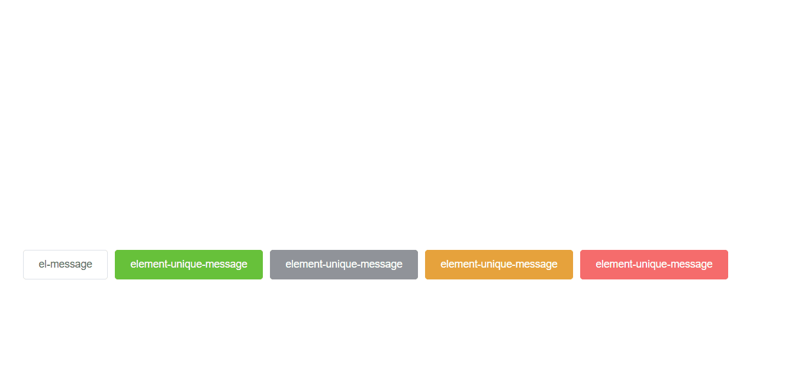

# Element Unique Message



`Element Unique Message` 是一个基于 `element-ui` 的消息组件，该组件确保在同一主题下的相同内容在消息展示持续期间不会再次出现，从而提升用户体验。支持el-message 的所有api。


## 安装

使用 npm 或 yarn 安装：

```bash
npm install element-unique-message
# 或者
yarn add element-unique-message
```

## 使用方法
```js
import ElementUniqueMessage from 'element-unique-message';
```
然后，你可以像使用 el-message 一样使用 ElementUniqueMessage：

```js
// 
ElementUniqueMessage({
  message: '这是一条信息',
  type: 'info',
});

ElementUniqueMessage.success('操作成功');
ElementUniqueMessage.warning('警告信息');
ElementUniqueMessage.info('信息提示');
ElementUniqueMessage.error('错误信息');
```

## 完整示例
请参考 [playground](./playground/src/App.vue)